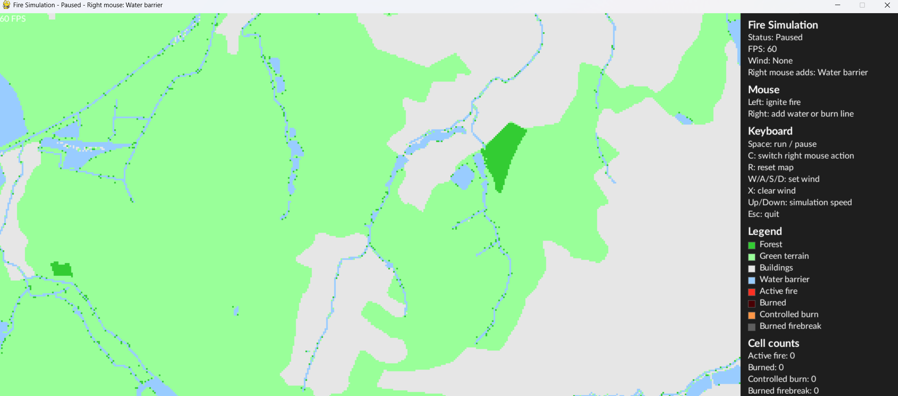
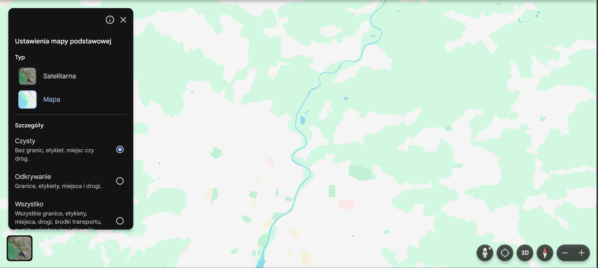
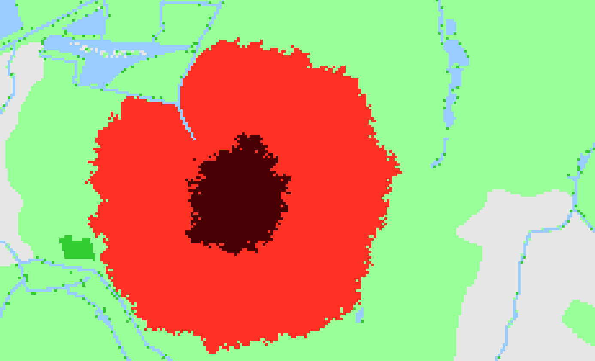
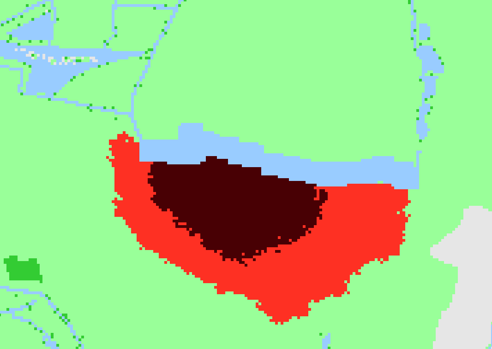
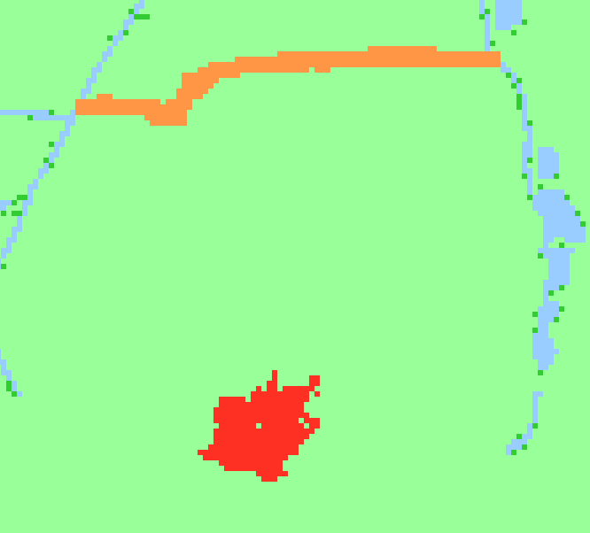
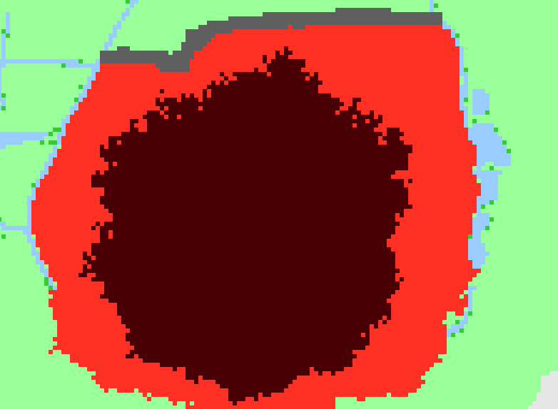
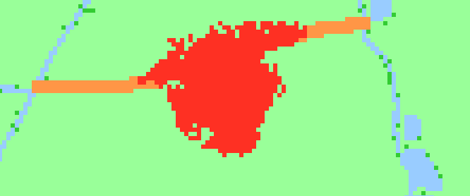

# Fire Simulation

[](https://github.com/NYXMatik/Fire_simulation/actions/workflows/project-report.yml)

Interactive cellular-automaton simulation of fire spread in a map-based
environment. The project converts clean Google Earth map screenshots into a
small set of terrain classes and then simulates fire propagation with
terrain-dependent probabilities, wind bias, water barriers, burned cells, and
controlled-burn firebreaks.



## Project Structure

```text
Fire_simulation/
|-- .github/workflows/
|   `-- project-report.yml          GitHub Actions workflow for tests and reports
|-- fire_simulation/
|   |-- app.py                      Interactive Pygame application
|   |-- converter.py                Map-image converter
|   |-- simulation.py               Cellular-automaton simulation logic
|   `-- __init__.py
|-- maps/
|   |-- map1.JPG                    Example source map
|   |-- map1_converted.png          Example converted map
|   |-- map2.JPG                    Example source map
|   `-- map2_converted.png          Default converted map used by the app/tests
|-- scripts/
|   |-- build_project_report.py     Formal PDF project-report generator
|   |-- build_test_report.py        Custom HTML test-report generator
|   `-- images/                     Images used by the report and README
|-- tests/
|   |-- test_behavioral.py          Behavioral model tests
|   |-- test_parameters.py          Parameter-sensitivity tests
|   |-- test_stability.py           Stability and reproducibility tests
|   `-- TESTING.txt                 Formal test-case documentation
|-- pytest.ini                      Pytest configuration
|-- requirements.txt                Python dependencies
`-- README.md
```

## Download the Project

Clone the repository:

```bash
git clone https://github.com/NYXMatik/Fire_simulation.git
cd Fire_simulation
```

The project was developed and tested on Windows. It should also work on Linux
and macOS because the code uses cross-platform Python libraries, but the
interactive simulation requires a working graphical desktop environment for
Pygame.

## Install Dependencies

Python 3.12 was used during development. A virtual environment is recommended:

```bash
python -m venv .venv
```

Activate it on Windows:

```bash
.venv\Scripts\activate
```

Activate it on Linux or macOS:

```bash
source .venv/bin/activate
```

Install the required libraries:

```bash
python -m pip install --upgrade pip
python -m pip install -r requirements.txt
```

The `requirements.txt` file contains the dependencies used by the converter,
the Pygame application, the report generators, and the automated test suite.

## Prepare a Map

The simulation works on converted map images. A clean Google Earth screenshot
is recommended because labels, borders, and roads can interfere with color-based
terrain classification.



To use a new map:

1. Open the selected area in Google Earth.
2. Use the map view rather than satellite view.
3. Select the clean style with labels and roads disabled.
4. Save the screenshot as a PNG or JPG file in the `maps/` directory.
5. Edit the input path in `fire_simulation/converter.py`:

```python
converted_image = convert_image('maps/map2.JPG')
```

Change `maps/map2.JPG` to the saved screenshot path. The output path is
controlled by:

```python
converted_image.save(f"maps/map2_converted.png")
```

Run the converter from the project root:

```bash
python -m fire_simulation.converter
```

## Run the Application

Start the interactive simulation from the project root:

```bash
python -m fire_simulation.app
```

At startup, the converted map is loaded and the simulation is paused. Press
`SPACE` to start or pause the simulation. Left click adds regular fire. Right
click adds the currently selected right-button action, which starts as a water
barrier. Press `C` to switch the right-button action between water and
controlled burn.

### Controls

| Input | Action |
| --- | --- |
| Left Mouse Button | Add active regular fire at the selected cell. |
| Right Mouse Button | Add the selected right-button action. |
| C | Switch right-button action between water barrier and controlled burn. |
| SPACE | Start or pause the simulation. |
| R | Reset the map. |
| W | Set wind to north. |
| A | Set wind to west. |
| S | Set wind to south. |
| D | Set wind to east. |
| X | Disable wind. |
| Up Arrow | Increase simulation FPS. |
| Down Arrow | Decrease simulation FPS. |
| ESCAPE | Quit the application. |

## How the Simulation Works

The environment is represented as a grid of terrain states. Green terrain,
forest, urban/low-fuel areas, water, active fire, burned cells, controlled fire,
and burned firebreaks are displayed with distinct colors. Fire spreads locally
from burning cells to neighbouring cells according to terrain-dependent
probabilities and spread speeds. Wind biases the spread direction toward the
selected wind vector.

After burning for long enough, cells become burned and no longer provide fuel.



Water barriers completely block fire spread through selected cells.



Controlled burn can be placed ahead of the regular fire. It does not spread by
itself and can become a burned firebreak if it burns out before regular fire
reaches it.



If the controlled burn burns out in time, it acts as a barrier.



If regular fire reaches controlled burn before burnout, regular fire takes over
and the controlled line is no longer controlled.



## Run Tests

Run the full test suite:

```bash
python -m pytest
```

Run selected groups:

```bash
python -m pytest tests/test_behavioral.py
python -m pytest tests/test_parameters.py
python -m pytest tests/test_stability.py
```

The suite contains behavioral tests, parameter-sensitivity tests, stability
tests, and reproducibility tests. Detailed formal documentation for every test
case is available in [`tests/TESTING.txt`](tests/TESTING.txt).

## Project and Test Reports

The most important reports are generated by the GitHub Actions workflow
[`Project Report`](https://github.com/NYXMatik/Fire_simulation/actions/workflows/project-report.yml).

To find the current reports on GitHub:

1. Open the repository on GitHub.
2. Go to the **Actions** tab.
3. Open the latest **Project Report** workflow run.
4. Download the artifact named `fire-simulation-project-report`.

The artifact contains:

| File | Purpose |
| --- | --- |
| `fire-simulation-project-report.pdf` | Formal project report. |
| `fire-simulation-test-report.html` | Custom HTML test report with summary chart and per-test diagnostics. |
| `pytest-report.html` | Standard pytest-html report. |
| `pytest-report.json` | Structured pytest data used by the custom report generator. |
| `pytest-junit.xml` | JUnit-compatible test report. |
| `pytest-output.txt` | Full pytest console output, including printed model metrics. |

When generated locally, these files are written to `reports/`:

```bash
python -m pytest \
  --capture=tee-sys \
  --json-report \
  --json-report-file=reports/pytest-report.json \
  --html=reports/pytest-report.html \
  --self-contained-html \
  --junitxml=reports/pytest-junit.xml

python scripts/build_test_report.py \
  --json reports/pytest-report.json \
  --output reports/fire-simulation-test-report.html

python scripts/build_project_report.py \
  --pytest-json reports/pytest-report.json \
  --pdf-output reports/fire-simulation-project-report.pdf
```

## References

- Trucchia, A. et al. (2020). [PROPAGATOR: An Operational Cellular-Automata Based Wildfire Simulator](https://doi.org/10.3390/fire3030026).
- Alexandridis, A. et al. (2008). [A cellular automata model for forest fire spread prediction: The case of the wildfire that swept through Spetses Island in 1990](https://doi.org/10.1016/j.amc.2008.06.046).
